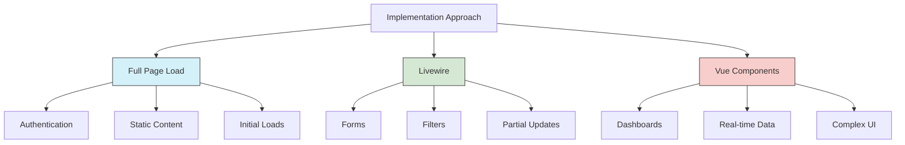

# Blade Templates Implementation Strategy

## Approach Analysis

### Full Page Load (Traditional Laravel)
- **Pros**:
  - Better initial SEO performance
  - Simpler implementation and debugging
  - Lower client-side resource requirements
- **Cons**:
  - Slower perceived performance
  - Full page refreshes required
- **Best For**:
  - Authentication flows (login/register)
  - Static content pages
  - Initial page loads

### Dynamic Loading Options

#### Vue Components
- **Pros**:
  - Excellent for complex interactions
  - Smooth single-page application experience
- **Cons**:
  - Requires robust API endpoints
  - More complex setup and maintenance
- **Best For**:
  - Dashboard components
  - Real-time data visualization

#### Livewire
- **Pros**:
  - PHP-driven interactivity
  - Excellent for form handling
  - Simpler than full Vue implementation
- **Cons**:
  - Still requires JavaScript
  - Limited to PHP-based interactivity
- **Best For**:
  - Form submissions
  - Interactive elements
  - Partial page updates

## Recommended Hybrid Approach

## Implementation Steps

1. **Initial Setup**
   - Configure Vite for asset bundling
   - Set up base Blade layouts
   - Establish Livewire components

2. **View Categorization**
   - Audit all views for interaction needs
   - Classify as static, interactive, or complex

3. **Performance Optimization**
   - Implement Laravel view caching
   - Configure route caching
   - Set up lazy loading for non-critical components

4. **SEO Considerations**
   - Server-render all critical content
   - Implement proper meta tags
   - Consider SSR for public Vue components

5. **Migration Plan**
   - Phase 1: Convert core pages to Blade
   - Phase 2: Implement Livewire components
   - Phase 3: Add Vue where necessary
   - Phase 4: Performance tuning