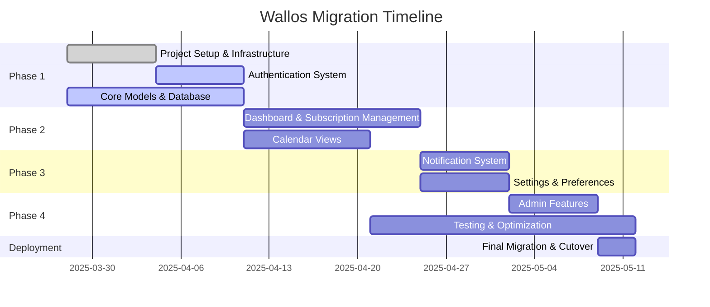
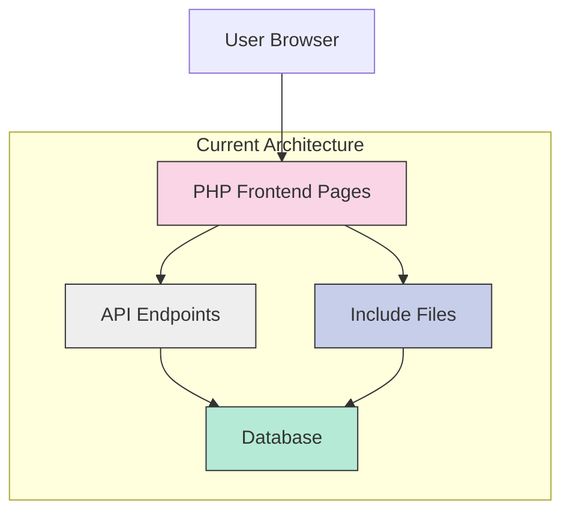
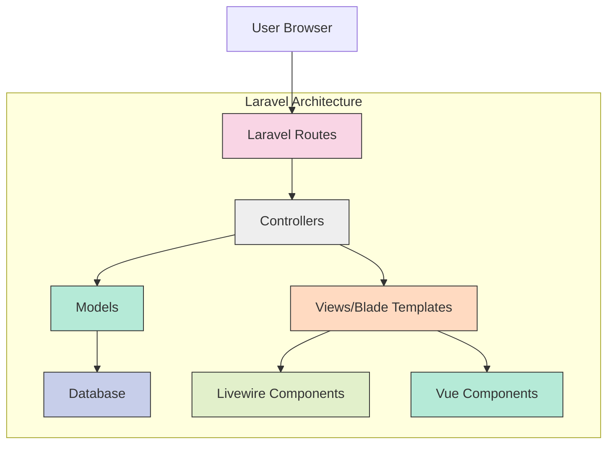
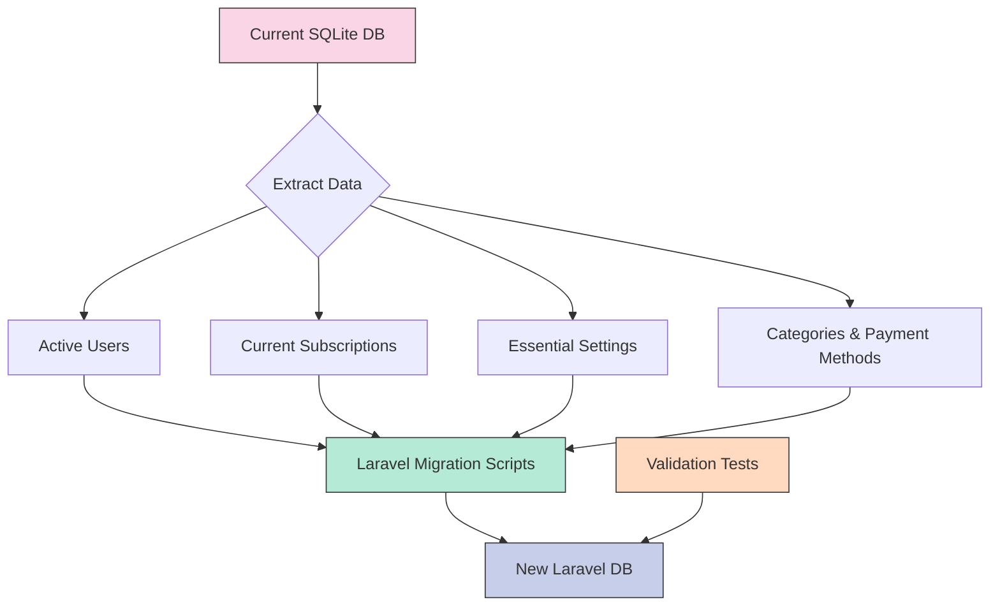
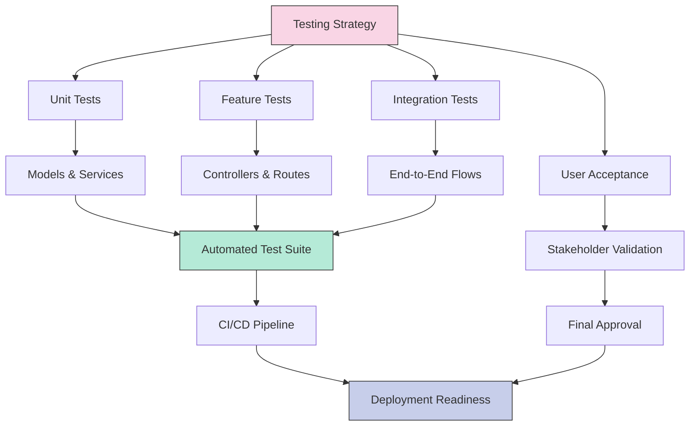
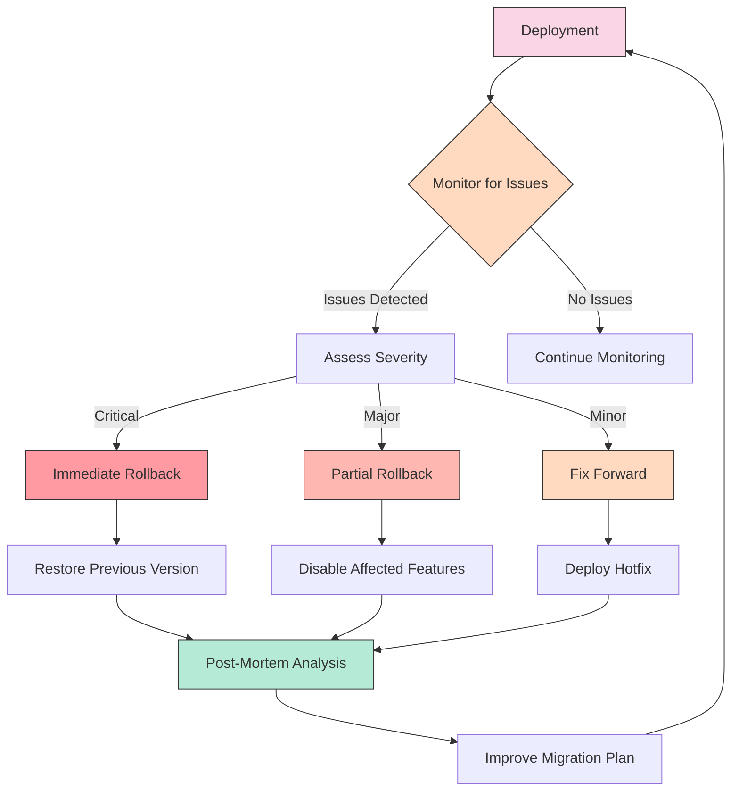

# Wallos Laravel Migration Strategy

## 1. Executive Summary

This document outlines the strategy for migrating the Wallos subscription management application from its current PHP implementation to a Laravel 12 framework. The migration will be a complete replacement with a focus on core functionality first, followed by administrative features.

## 2. Current Architecture Analysis

The current Wallos application follows a traditional PHP structure:

### Key Components:
- **Frontend Pages**: PHP files in root directory (index.php, admin.php, calendar.php, etc.)
- **API Endpoints**: Located in /api/ and /endpoints/ directories
- **Database**: SQLite database with migrations
- **Assets**: CSS, JavaScript, and images

## 3. Target Architecture

The Laravel implementation will follow MVC architecture:

### Key Components:
- **Routes**: Web and API routes defined in routes/web.php
- **Controllers**: Handle business logic in app/Http/Controllers/
- **Models**: Eloquent models in app/Models/
- **Views**: Blade templates in resources/views/
- **Components**: Livewire for interactive elements, Vue for complex UI

## 4. Module-by-Module Migration Plan

### 4.1 Authentication Module

**Current Components:**
- login.php, logout.php, registration.php, passwordreset.php, totp.php
- User session management in includes/checksession.php

**Migration Tasks:**
1. Complete Laravel Auth controllers implementation
2. Finalize Blade templates for login, registration, password reset
3. Implement 2FA with Laravel Fortify
4. Test authentication flows

**Timeline:** Week 1-2

**Dependencies:**
- User model
- Email configuration

**Testing Criteria:**
- User registration
- Login with credentials
- Password reset flow
- 2FA enrollment and verification

### 4.2 Dashboard & Subscription Management

**Current Components:**
- index.php (dashboard)
- subscription management in endpoints/subscription/
- API endpoints in api/subscriptions/

**Migration Tasks:**
1. Complete SubscriptionController implementation
2. Develop Blade templates for subscription CRUD
3. Implement Livewire components for interactive elements
4. Create dashboard view with subscription summary

**Timeline:** Week 2-4

**Dependencies:**
- Authentication module
- Subscription model
- Category model
- Payment method model

**Testing Criteria:**
- View subscription list
- Add/edit/delete subscriptions
- Filter and sort functionality
- Dashboard statistics accuracy

### 4.3 Calendar Module

**Current Components:**
- calendar.php
- Calendar data in endpoints/subscription/getcalendar.php
- iCal export in api/subscriptions/get_ical_feed.php

**Migration Tasks:**
1. Create CalendarController
2. Implement calendar view with date-based subscription display
3. Develop iCal feed generation
4. Add export functionality

**Timeline:** Week 2-3

**Dependencies:**
- Subscription module
- Date handling utilities

**Testing Criteria:**
- Calendar view accuracy
- Date navigation
- iCal export functionality
- Mobile responsiveness

### 4.4 Notification System

**Current Components:**
- Notification settings in endpoints/notifications/
- Email, Discord, Telegram, etc. notification handlers

**Migration Tasks:**
1. Implement notification models
2. Create notification settings controllers
3. Develop notification sending services
4. Set up scheduled tasks for notifications

**Timeline:** Week 4-5

**Dependencies:**
- Subscription module
- User model

**Testing Criteria:**
- Notification settings persistence
- Test notifications delivery
- Scheduled notification triggers

### 4.5 Settings & Preferences

**Current Components:**
- settings.php
- Theme and display settings in endpoints/settings/
- Currency settings in endpoints/currency/

**Migration Tasks:**
1. Create SettingsController
2. Implement settings models
3. Develop settings views with Livewire components
4. Add theme switching functionality

**Timeline:** Week 4-5

**Dependencies:**
- Authentication module
- Core application structure

**Testing Criteria:**
- Settings persistence
- Theme switching
- Currency format changes
- User preference application

### 4.6 Admin Features

**Current Components:**
- admin.php
- Admin endpoints in endpoints/admin/

**Migration Tasks:**
1. Create AdminController with role-based access
2. Implement user management features
3. Develop system settings administration
4. Add logging and monitoring

**Timeline:** Week 5-6

**Dependencies:**
- Authentication with role management
- User model
- Settings module

**Testing Criteria:**
- Admin access control
- User management functions
- System settings modification
- Audit logging

### 4.7 Statistics & Reporting

**Current Components:**
- stats.php
- Data aggregation in API endpoints

**Migration Tasks:**
1. Create StatsController
2. Implement data aggregation services
3. Develop visualization components
4. Add export functionality

**Timeline:** Week 5-6

**Dependencies:**
- Subscription module
- Payment records

**Testing Criteria:**
- Statistics accuracy
- Chart rendering
- Data filtering
- Export functionality

## 5. Data Migration Strategy

### 5.1 Data Migration Approach

1. **Extract Current Data:**
   - Focus on active users and current subscriptions
   - Include essential settings and preferences
   - Migrate categories and payment methods

2. **Transformation Process:**
   - Convert data to match new schema
   - Apply data validation rules
   - Handle any structural changes

3. **Loading Strategy:**
   - Use Laravel seeders for initial data
   - Create one-time migration scripts for production data
   - Implement validation checks

### 5.2 Data Priorities

1. **High Priority:**
   - User accounts and credentials
   - Active subscriptions
   - Categories and payment methods
   - Core settings

2. **Medium Priority:**
   - User preferences
   - Notification settings
   - Currency configurations

3. **Low Priority (Optional):**
   - Historical payment records
   - Inactive subscriptions
   - Usage statistics

## 6. Implementation Timeline

### Week 1: Foundation
- Complete project setup
- Finalize database schema
- Implement authentication system
- Begin core models development

### Week 2-3: Core Functionality
- Complete subscription management
- Implement dashboard
- Develop calendar views
- Set up basic settings

### Week 4-5: Extended Features
- Implement notification system
- Complete settings and preferences
- Begin admin features
- Start statistics implementation

### Week 6-7: Finalization
- Complete admin features
- Finalize statistics and reporting
- Comprehensive testing
- Performance optimization

### Week 8: Deployment
- Final data migration
- Production deployment
- Monitoring and support
- Documentation completion

## 7. Testing Strategy

### 7.1 Testing Levels

1. **Unit Testing:**
   - Model validation and relationships
   - Service classes and utilities
   - Helper functions

2. **Feature Testing:**
   - Controller actions
   - Route functionality
   - Middleware behavior

3. **Integration Testing:**
   - Authentication flows
   - Subscription management
   - Notification delivery

4. **User Acceptance Testing:**
   - Core user journeys
   - Admin workflows
   - Edge cases

### 7.2 Testing Procedures

1. **Automated Testing:**
   - PHPUnit for backend tests
   - Laravel Dusk for browser testing
   - CI/CD integration

2. **Manual Testing:**
   - Cross-browser compatibility
   - Mobile responsiveness
   - Accessibility compliance

3. **Performance Testing:**
   - Load testing with realistic user numbers
   - Database query optimization
   - Asset loading performance

## 8. Rollback Strategy

### 8.1 Rollback Triggers

1. **Critical Issues:**
   - Authentication failures
   - Data corruption
   - Security vulnerabilities

2. **Major Issues:**
   - Core functionality broken
   - Significant performance degradation
   - Multiple features affected

3. **Minor Issues:**
   - UI/UX inconsistencies
   - Non-critical feature bugs
   - Performance edge cases

### 8.2 Rollback Procedures

1. **Complete Rollback:**
   - Restore previous application version
   - Revert database to pre-migration state
   - Update DNS/routing to original application

2. **Partial Rollback:**
   - Disable affected features
   - Implement temporary workarounds
   - Maintain core functionality

3. **Fix Forward:**
   - Deploy hotfixes to production
   - Implement temporary mitigations
   - Accelerate planned updates

### 8.3 Communication Plan

1. **Internal Communication:**
   - Issue alert system
   - Status updates to development team
   - Decision-making protocol

2. **User Communication:**
   - Status page updates
   - Email notifications for major issues
   - In-app messaging for minor issues

## 9. Risks and Mitigation

| Risk | Probability | Impact | Mitigation |
|------|------------|--------|------------|
| Timeline slippage | Medium | High | Prioritize core features, use incremental delivery |
| Data migration issues | Medium | High | Create comprehensive validation tests, maintain backups |
| Performance degradation | Low | Medium | Implement performance testing early, optimize queries |
| User adoption challenges | Medium | Medium | Maintain UI consistency, provide clear documentation |
| Security vulnerabilities | Low | High | Conduct security audit, follow Laravel best practices |
| Third-party integration failures | Medium | Medium | Test integrations early, maintain fallback options |

## 10. Success Criteria

1. **Functional Criteria:**
   - All critical features working as expected
   - Data migrated accurately
   - Performance equal or better than original

2. **Technical Criteria:**
   - Code quality meets standards
   - Test coverage above 80%
   - No critical security issues

3. **User Criteria:**
   - Minimal disruption during transition
   - Familiar UI/UX with improvements
   - All user data preserved

## 11. Post-Migration Activities

1. **Monitoring:**
   - Set up application monitoring
   - Implement error tracking
   - Monitor performance metrics

2. **Optimization:**
   - Identify performance bottlenecks
   - Optimize database queries
   - Improve asset loading

3. **Documentation:**
   - Update user documentation
   - Create technical documentation
   - Document architecture decisions

4. **Future Enhancements:**
   - Identify improvement opportunities
   - Plan feature enhancements
   - Consider architectural improvements